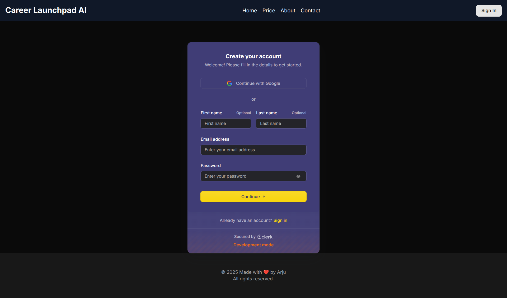
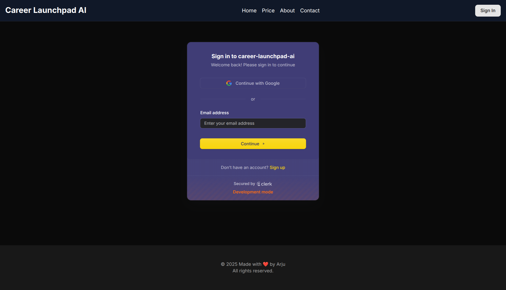
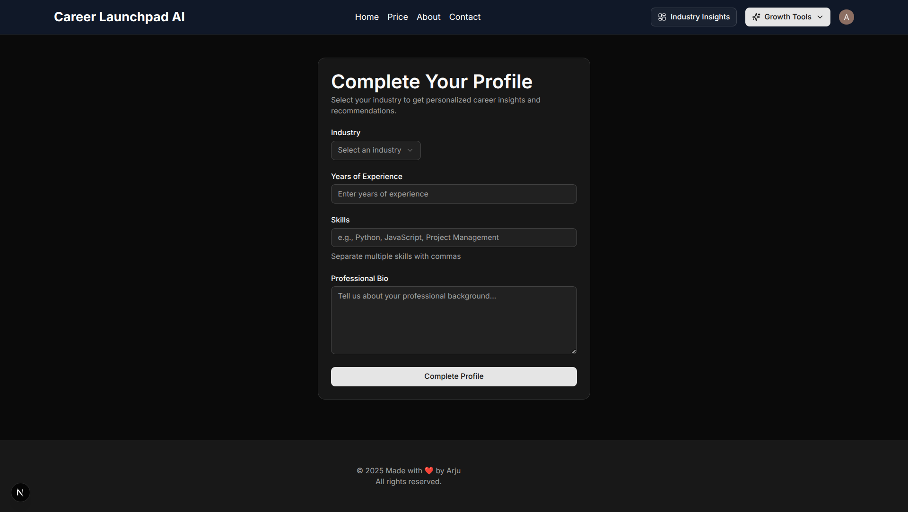
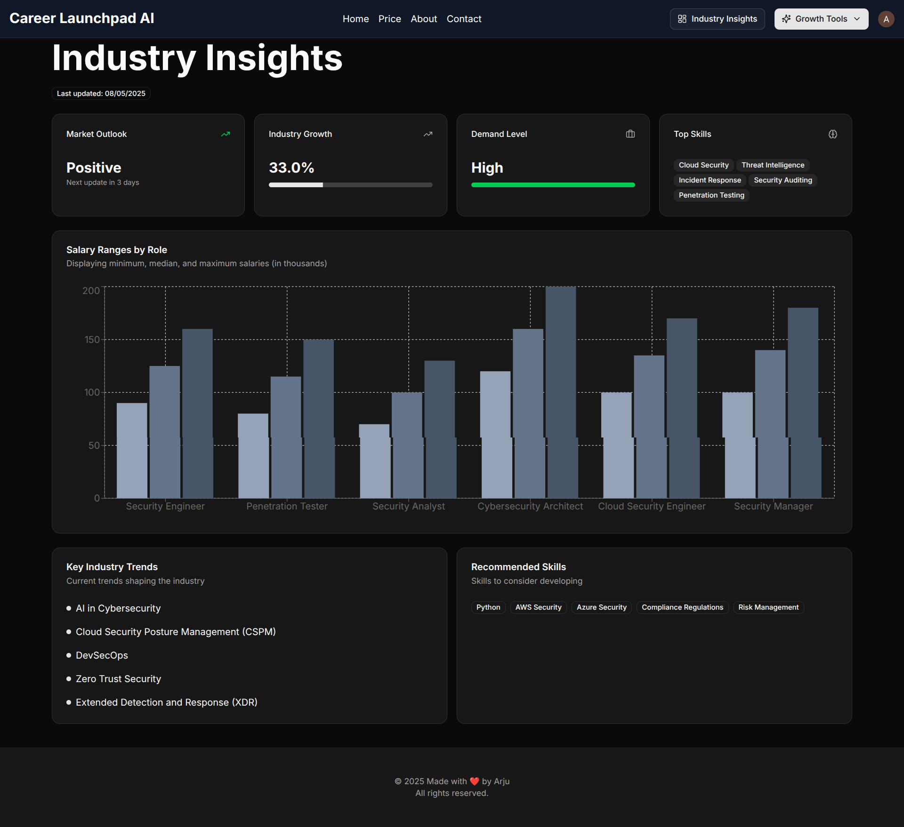
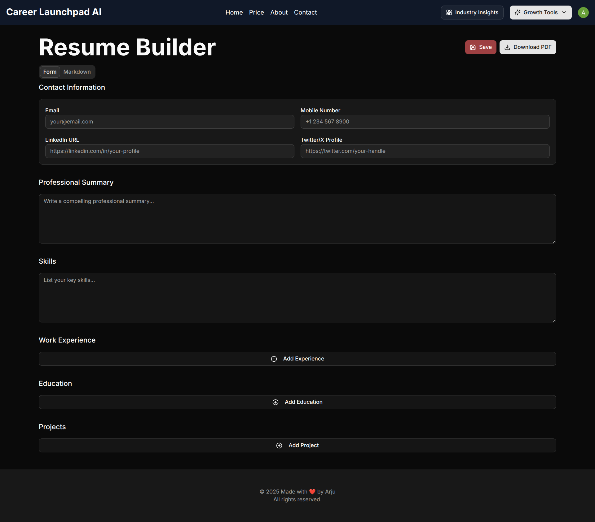
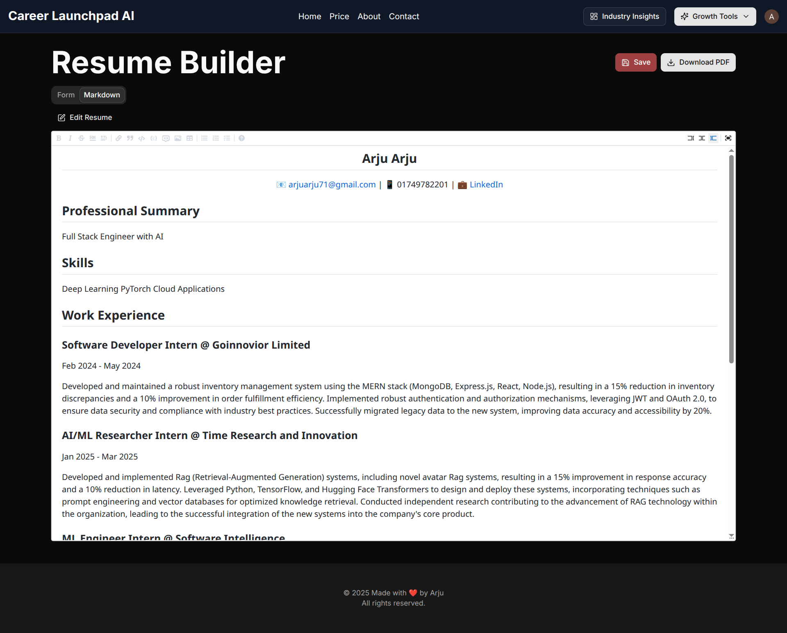
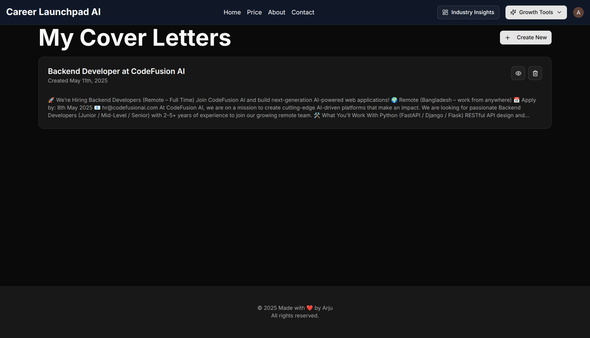
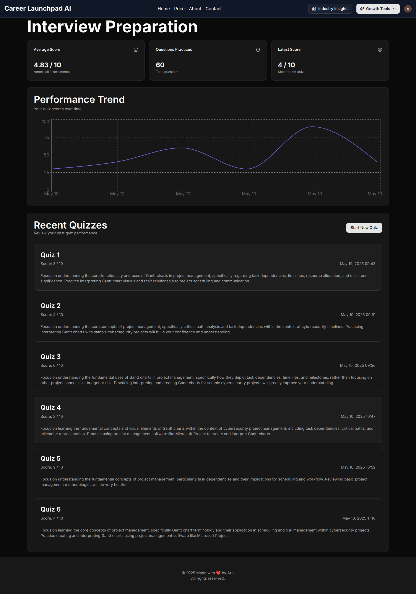

<center> <h1> 🚀 Career Launchpad AI </h1></center>

### 🔗 Live Demo

👉 [View Live Project](https://career-launchpad-ai.vercel.app/)

## 🧠 AI Career Assistant Platform

An AI-powered career assistant web application built using **Next.js 15 App Router**, **ShadCN UI**, **Gemini AI**, **Inngest**, and **Prisma**. This platform helps users get **industry insights**, **prepare for interviews**, **build resumes**, and **generate cover letters** — all powered by AI.

---

## 🚀 Features Overview

| Feature                                  | Description                                                                 |
|------------------------------------------|-----------------------------------------------------------------------------|
| 🔐 Authentication                        | Secure sign up/login with custom UI                                        |
| 👤 User Onboarding                       | Collects role, experience, skills, etc.                                    |
| 📊 Industry Insights                     | Weekly AI-generated market trends                                          |
| 🤖 AI-Powered Mock Interviews            | Generate personalized interview questions                                  |
| 📈 Interview Stats                       | Visualize your mock performance stats                                      |
| 📄 AI Resume Builder                     | Create beautiful Markdown resumes with AI                                 |
| 📨 Cover Letter Generator                | Instantly create a custom cover letter                                    |
| 🕒 Cron Jobs with Inngest                | Weekly insights sent via scheduled functions                              |
| 📦 Fully Responsive UI                   | Built with ShadCN UI, Tailwind CSS                                         |

---

## 🧱 Tech Stack

- **Framework**: [Next.js 15](https://nextjs.org/)
- **Styling**: [ShadCN UI](https://ui.shadcn.com/), Tailwind CSS
- **Auth**: [Clerk](https://go.clerk.com/)
- **Database**: PostgreSQL with Prisma ORM , [Neon](https://fyi.neon.tech)
- **AI Integration**: [Gemini Pro API](https://ai.google.dev/gemini-api/docs/api-key)
- **CRON Jobs**: [Inngest](https://www.inngest.com/)
- **Deployment**: [Vercel](https://vercel.com/)

---

## 🧑‍💻 Getting Started

### 1️⃣ Clone the repository

```bash
git clone https://github.com/arju10/Career-Launchpad-AI.git
cd Career-Launchpad-AI
````

### 2️⃣ Install dependencies

```bash
npm install
```

### 3️⃣ Setup Environment Variables

Create a `.env` file and include the following:

```
DATABASE_URL=

NEXT_PUBLIC_CLERK_PUBLISHABLE_KEY=
CLERK_SECRET_KEY=

NEXT_PUBLIC_CLERK_SIGN_IN_URL=/sign-in
NEXT_PUBLIC_CLERK_SIGN_UP_URL=/sign-up
NEXT_PUBLIC_CLERK_AFTER_SIGN_IN_URL=/onboarding
NEXT_PUBLIC_CLERK_AFTER_SIGN_UP_URL=/onboarding

GEMINI_API_KEY=
```

### 4️⃣ Setup Prisma

```bash
npx prisma init
npx prisma migrate dev --name create-models
```
### 5️⃣ Start Inngest Dev Server

```bash
npx inngest-cli@latest dev
```
### 6️⃣Start Development Server

```bash
npm run dev
```

---

## 📦 Deployment

Easily deploy on **[Vercel](https://vercel.com/)**:

```bash
vercel
```

Make sure to add your environment variables in Vercel’s dashboard under Project > Settings > Environment Variables.

---

## 📸 Screenshots

### 🏠 Landing Page


--- 

### 🔐 Signup & Signin

 
 </br>

---

### 👤 User Profile
 


---
### 🧠 Industry Insights (Powered by Google Gemini AI)
Industry insights powered by Google Gemini AI.


---
### 📄 Resume Builder
Build and download your professional resume in seconds.
 </br>
 </br>


---
### ✉️ Cover Letter Generator
Build and download your professional cover letter in seconds.
 </br>

 </br>

---

### 🎤 Interview Preparation
 </br>

 </br>

---

## 🙋‍♂️ Contact

For questions, reach out via \[[mst.tahminajerinarju@gmail.com](mailto:mst.tahminajerinarju@gmail.com)] 

---

